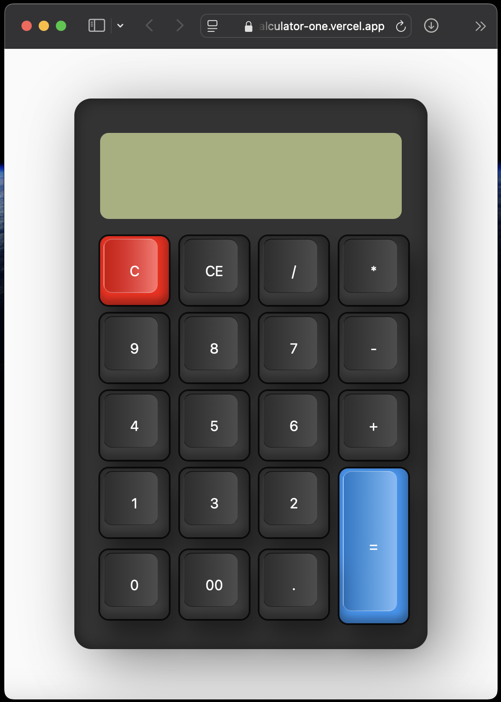

# Classic Calculator - JavaScript

A simple Classic Calculator built using HTML, CSS, and JavaScript.

## 🚀 Clone the Repository

```bash
git clone https://github.com/ahmadrizal1st/classic-calculator-js.git
cd classic-calculator-js
```
## 💻 Demo Project
